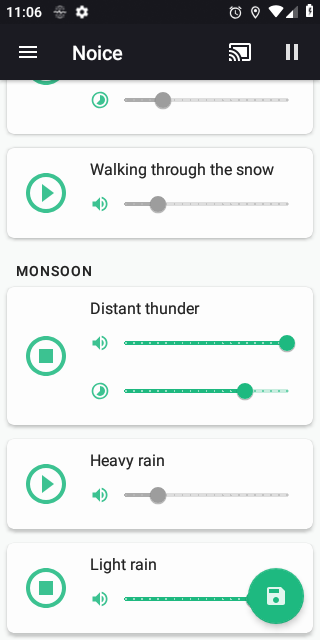
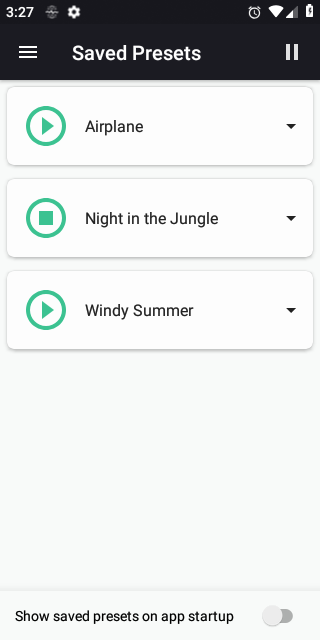
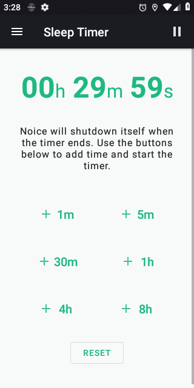
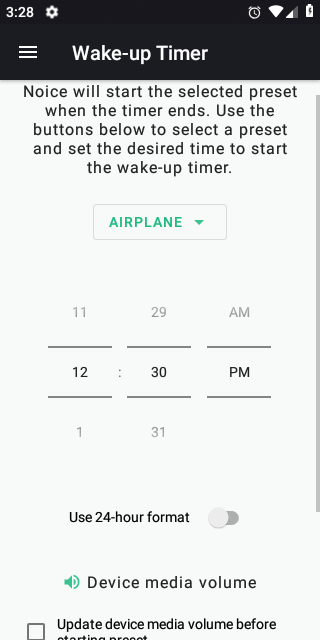
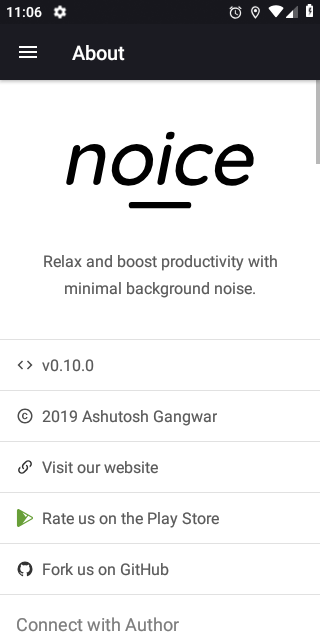
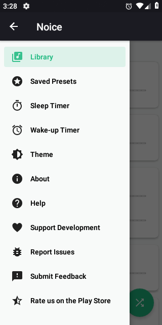
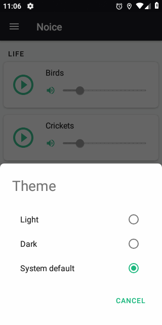

sound therapy is an app that allows you to create your own set of background sounds by mixing clips from environmental sources. Create your perfect surroundings by combining different sounds to drown out distractions so you can focus on your work, or generate serene, peaceful environments that encourage you to fall asleep.

## Screenshots

|                                                                                |                                                                                |                                                                                |                                                                                |
| ------------------------------------------------------------------------------ | ------------------------------------------------------------------------------ | ------------------------------------------------------------------------------ | ------------------------------------------------------------------------------ |
|  |  |  |  |
|  |  |  |                                                                                |

